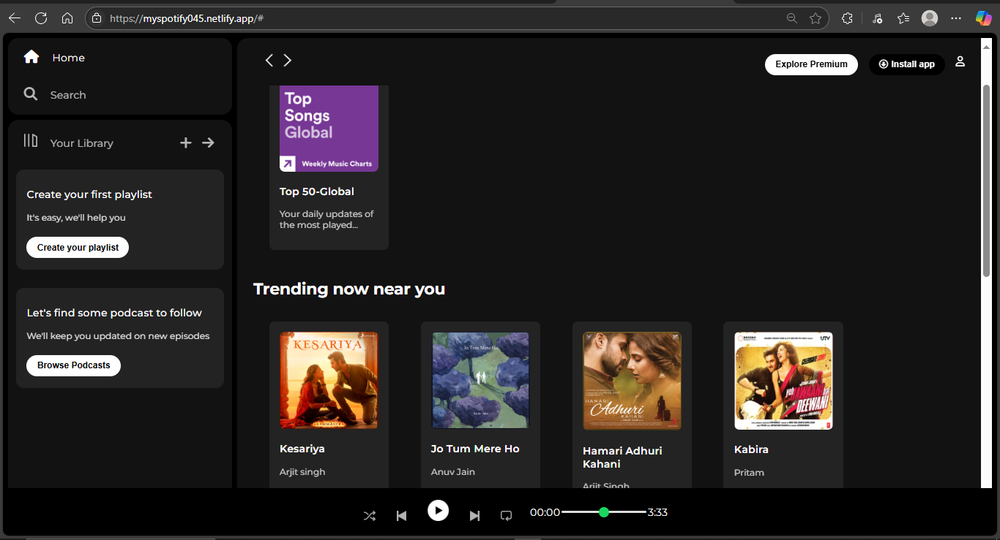

# 🎵 Spotify Clone (HTML & CSS)

A simple **Spotify Clone** built using only **HTML** and **CSS**.  
This project replicates the look and feel of Spotify’s web player with a clean UI and responsive design.

---

## 📸 Screenshots

### Spotify Logo


### Project UI


---

## 🚀 Features
- 🎶 Spotify-like homepage  
- 🎧 Responsive music player layout  
- 📱 Mobile-friendly design  
- 🎨 Styled using pure **CSS** (no frameworks)  

---

## 🛠️ Tech Stack
- **HTML5** – Structure of the app  
- **CSS3** – Styling and layout  

---

## 📂 Project Setup

1. Clone the repository:
   ```bash
   git clone https://github.com/your-username/spotify-clone.git
